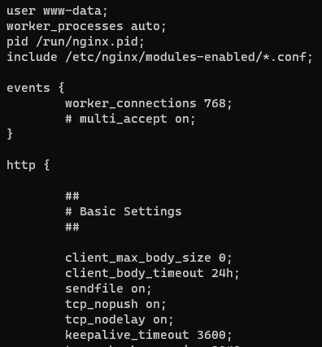

## Local test

Just install requirements:
``` bash
python -m venv venv
./venv/Scripts/activate
pip install -r requirements.txt
```

create superuser:
``` bash
python manage.py createsuperuser
```

and start project:
``` bash
python manage.py runserver
```


## Local test with docker and docker-compose

I hope you have **[Docker with docker-compose](https://docs.docker.com/compose/install/)** installed on your machine, so you can run:
``` bash
docker-compose up -d --build
```

Then enter `django_dtc` container and **create superuser**:
``` bash
docker exec -it django_dtc bash
python manage.py createsuperuser
```

That's it!


## Deploy with Dokku on Ubuntu 20.04:

``` bash
wget https://raw.githubusercontent.com/dokku/dokku/v0.27.8/bootstrap.sh
sudo DOKKU_TAG=v0.27.8 bash bootstrap.sh
```

``` bash
sudo dokku plugin:install https://github.com/dokku/dokku-postgres.git postgres
```

``` bash
sudo dokku plugin:install https://github.com/dokku/dokku-letsencrypt.git
```

``` bash
ssh-keygen # Do not set password :)
```

``` bash
cat ~/.ssh/id_rsa.pub | dokku ssh-keys:add root@localhost
```


``` bash
cat ~/.ssh/id_rsa # Copy full output
```
Set `SSH_PRIVATE_KEY_<BRANCH_NAME>` secret variable via GitHub repo settings. Paste private key from previous command's output

After that we can continue:

``` bash
dokku apps:create dtc
```

``` bash
dokku postgres:create dtc
dokku postgres:link dtc dtc
```

If you want to connect to the database via DataGrip, for example, copy the password in the connection string that will be in the output of the previous command. In addition, you need to forward the port, which Dokku can do for you:

``` bash
dokku postgres:expose dtc
```


``` bash 
dokku config:set dtc DJANGO_DEBUG=False LANGUAGE_CODE=ru TZ=Asia/Tashkent
```


``` bash
sudo timedatectl set-timezone Asia/Tashkent
```


``` bash
dokku config:set --global DOKKU_LETSENCRYPT_EMAIL=<YOUR@EMAIL.COM>
dokku domains:add dtc <DOMAIN>
dokku letsencrypt:enable dtc
```

``` bash
dokku storage:ensure-directory dtc
dokku storage:mount dtc /var/lib/dokku/data/storage/dtc:/code/static/media
```

Add your **DOMAIN** to **core.settings.ALLOWED_HOSTS**

``` bash
dokku enter dtc web
```

``` bash
python manage.py createsuperuser
```

Nginx by default needs a little improvement:

``` bash
sudo vim /etc/nginx/nginx.conf
```

Set `keepalive_timeout` to **3600**

Add 2 lines at the top of http section:

``` bash
client_max_body_size 0;
client_body_timeout 24h;
```


Restart Nginx:
``` bash
service nginx restart
```

To view logs enter this:

``` bash
dokku logs dtc -t
```
